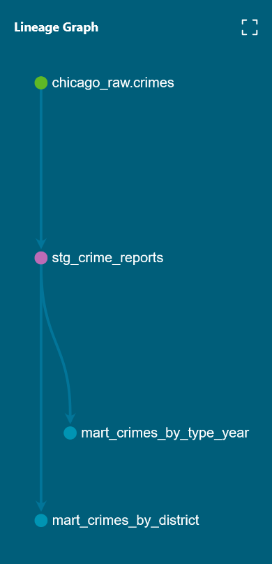
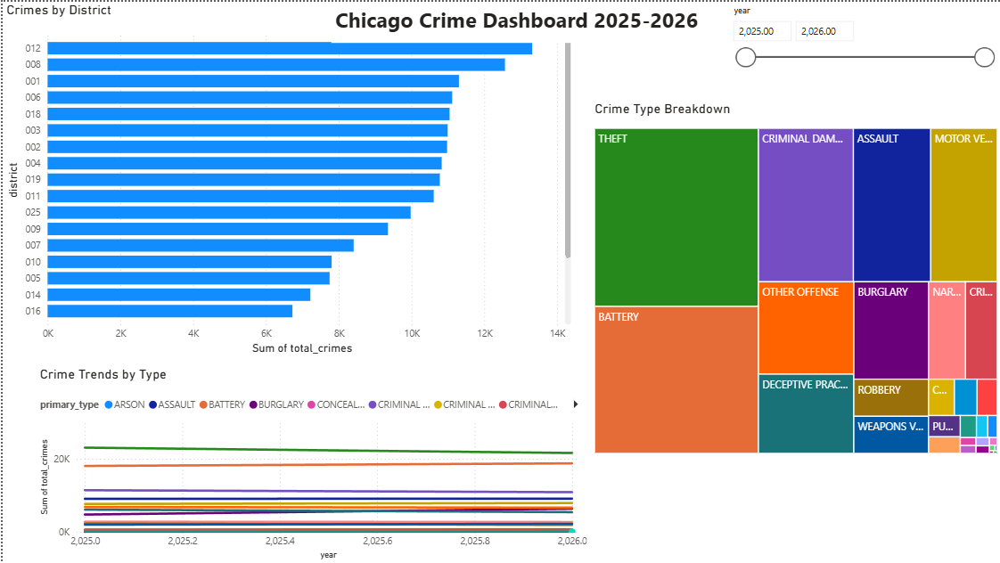

# Chicago Crime Data Pipeline

An end-to-end data engineering project that ingests, transforms, and visualizes Chicago crime data using a modern cloud stack.

## Architecture



## Dashboard



## Stack

| Layer | Tool |
|-------|------|
| Orchestration | Apache Airflow (Astro CLI + Docker) |
| Storage | AWS S3 |
| Warehouse | AWS Redshift Serverless |
| Transformation | dbt Core |
| Visualization | Power BI |
| CI/CD | GitHub Actions |
| Language | Python |

## Pipeline Overview

1. **Ingest** — Python script pulls 100,000+ crime records from the Chicago Data Portal API and lands them in AWS S3
2. **Orchestrate** — Apache Airflow DAG runs the pipeline daily with automated data quality checks (row count, null checks, schema validation)
3. **Load** — Raw CSV files copied from S3 into Redshift Serverless via COPY command
4. **Transform** — dbt Core builds staging and mart models with type casting, deduplication, and aggregations
5. **Test** — dbt schema tests (not_null, unique, accepted_values) run on every push via GitHub Actions CI
6. **Visualize** — Power BI dashboard connected live to Redshift showing crime trends by district, type, and year

## Dataset

- Source: [Chicago Data Portal](https://data.cityofchicago.org/resource/ijzp-q8t2.json)
- 200,000 rows, 22 columns
- Date range: 2025-2026
- Top crime types: Theft, Battery, Criminal Damage, Assault, Motor Vehicle Theft
- Top districts: 12, 8, 2, 6, 1

## dbt Models

chicago_raw
└── crimes (source)

chicago_staging
└── stg_crime_reports (cleaned, cast, deduplicated)

chicago_marts
├── mart_crimes_by_district (aggregated by district + year)
└── mart_crimes_by_type_year (aggregated by type + year)


## Data Quality

- not_null tests on id, crime_date, district, primary_type
- unique test on id
- accepted_values test on primary_type (32 crime types)
- Row count assertion in Airflow (fails if < 1,000 rows)
- GitHub Actions runs dbt test on every push to main

## Setup

### Prerequisites

- Docker Desktop
- Astro CLI
- Python 3.11+
- AWS account
- dbt Core

### Running locally

1. Clone the repo

```bash
git clone https://github.com/ktsuchiya31/chicago-crime-de-pipeline.git
cd chicago-crime-de-pipeline
```

2. Set up environment variables

```bash
cp .env.example .env
```

Fill in your AWS and Redshift credentials in the .env file.

3. Start Airflow

```bash
astro dev start
```

4. Run the ingestion DAG from the Airflow UI at localhost:8080

5. Run dbt models

```bash
cd dbt/chicago_crime
dbt run
dbt test
```

## CI/CD

GitHub Actions automatically runs dbt test on every push to main. 
The workflow installs dbt, connects to Redshift Serverless, 
and runs all schema tests. A failing test blocks the merge.

## Project Structure

chicago-crime-de-pipeline/
├── dags/
│ ├── hello_chicago.py
│ └── ingest_crimes_dag.py
├── scripts/
│ ├── download_data.py
│ ├── ingest_crimes.py
│ └── test_s3.py
├── dbt/
│ └── chicago_crime/
│ ├── models/
│ │ ├── staging/
│ │ │ ├── sources.yml
│ │ │ ├── schema.yml
│ │ │ └── stg_crime_reports.sql
│ │ └── marts/
│ │ ├── schema.yml
│ │ ├── mart_crimes_by_district.sql
│ │ └── mart_crimes_by_type_year.sql
│ └── macros/
│ └── generate_schema_name.sql
├── docs/
│ └── images/
│ ├── Chicago-crime-Lineage-Graph.png
│ └── Chicago-Crime-Dashboard.png
├── powerbi/
│ └── Chicago-Crime-Dashboard.pbix
├── .github/
│ └── workflows/
│ └── dbt_ci.yml
├── .env
├── .gitignore
└── README.md